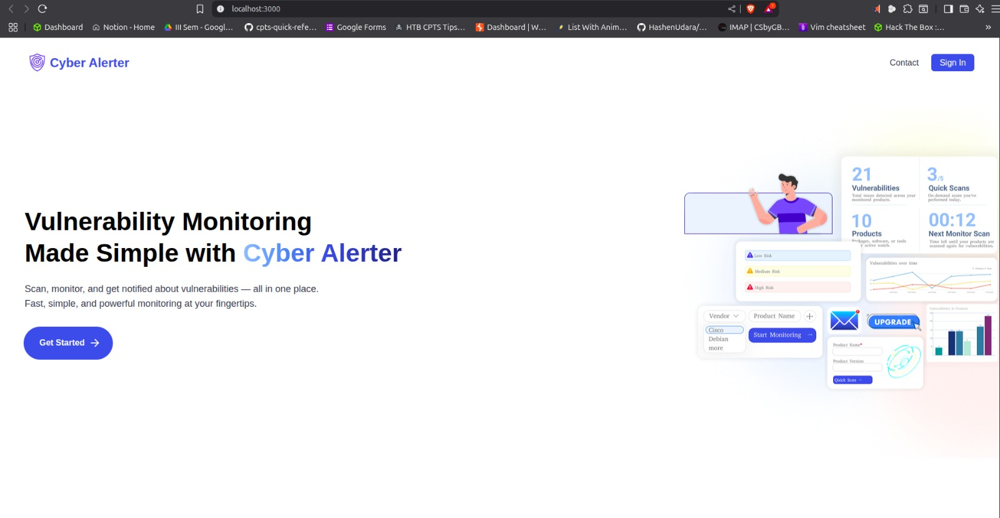
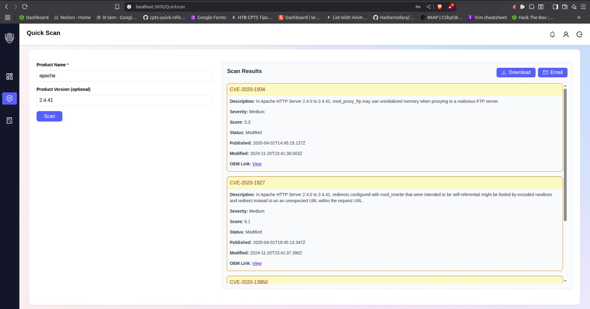
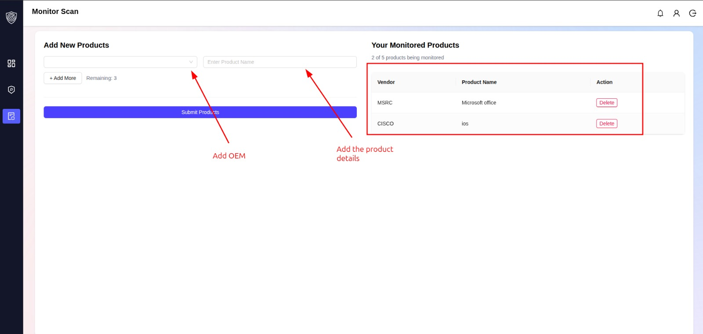
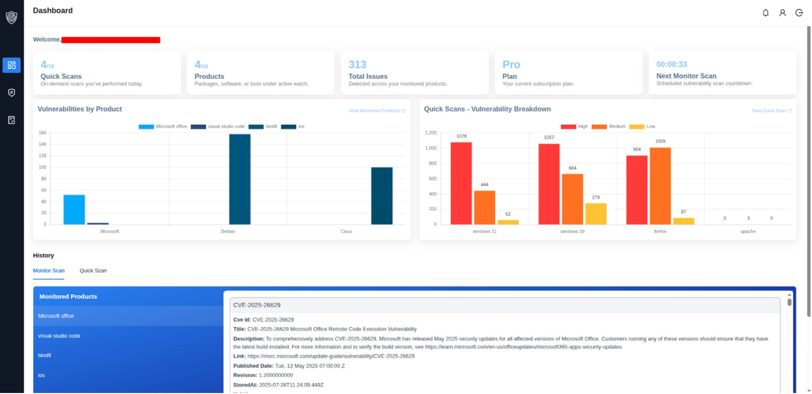
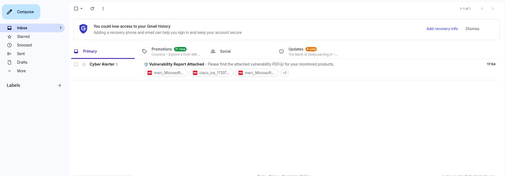

# Cyber Alerter

Cyber Alerter is an automated vulnerability monitoring system that integrates data from the National Vulnerability Database (NVD) and OEM advisories to help users efficiently track and manage software security risks.

## Features

- **Quick Scan:** Instantly search vulnerabilities by product name or CVE ID.
- **Monitor Scan:** Continuously track selected products and receive scheduled alerts.
- **Real-Time Email Notifications:** Get scan results and PDF reports delivered to your inbox.
- **User-Friendly Dashboard:** View all scans, monitored products, and vulnerability stats at a glance.

## Technology Stack

- **Backend:** Node.js, MongoDB
- **Frontend:** React.js
- **Email Service:** Nodemailer

## Getting Started

1. **Clone the repository**
    ```
    git clone https://github.com/yourusername/cyber-alerter.git
    ```
2. **Install dependencies**
    ```
    cd cyber-alerter
    npm install
    ```
3. **Set up environment variables**
    - Configure your MongoDB connection string, email service credentials, and any relevant API keys in a `.env` file.

4. **Run the backend server**
    ```
    npm install
    npx nodemon app.js
    ```

5. **Run the frontend (if separate)**
    ```
    npm install
    npm start
    ```

## Usage

- Sign up and log in to access the dashboard.
- Perform Quick Scans or add products/services to Monitor Scan.
- Receive email alerts and download PDF reports for your records.

## Screenshots











## Contributing

Contributions are welcome! Please open issues or submit pull requests for bug fixes, features, or improvements.

```
Note
add your own api key for the code for cisco, NVD
.env
```